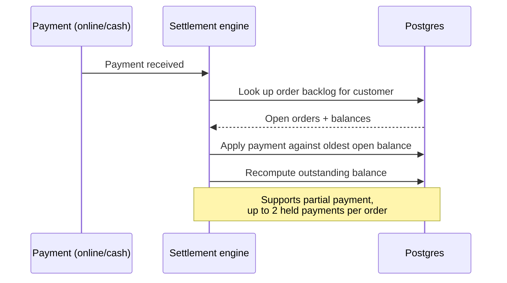
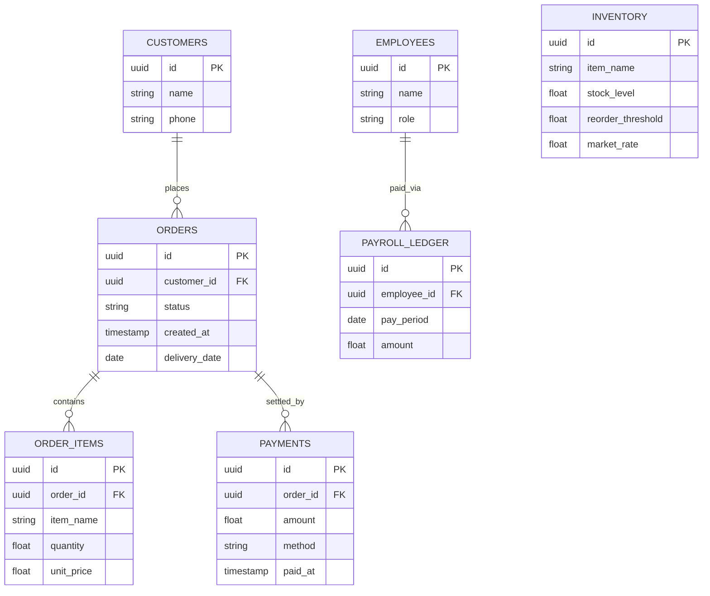

# Ganesh Sales — operations platform

A backend system for a distribution business (300+ customers, 9 employees) that replaces manual notebook and Tally based tracking with a SQL backed platform, LLM powered order intake, and an agentic query layer.

## Problem

Orders come in over WhatsApp and phone calls. Payments come in online and in cash, often as partial payments against a backlog of orders. Reconciling all of this by hand took about an hour a day and regularly left unexplained balance gaps.

## What this builds

- **Automated order intake** — parses confirmed WhatsApp order messages via LLM extraction into structured orders, validated against live inventory.
- **Settlement engine** — tracks partial and multi invoice payments across online and cash channels, computes outstanding balance per customer, and produces end of day closing reports.
- **Inventory tracking** — reorder alerts based on order velocity and a daily market rate.
- **Payroll** — tracks pay for a 9 person team.
- **Agentic query layer** — LLM tool calling that answers natural language questions by routing between a SQL tool (payments, delivery status, inventory) and a vector search tool over embedded WhatsApp order history.
- **Dashboard** — a Streamlit view of accounts, backlog, settlements, inventory, and daily closing.

## Architecture

Single modular FastAPI app (`intake`, `core data`, `query agent`) rather than separate microservices. Clean internal module boundaries, one deployment, one database connection pool — no network hop, no distributed transaction problem, no operational overhead a system at this scale doesn't need.

### Order intake flow

### Payment settlement flow

## Data model

## Technical depth

**Order intake**
- Webhook receiver (FastAPI) ingests WhatsApp Business API messages synchronously — order volume (10–15/day) doesn't justify a queue.
- Extraction uses Claude Haiku with a structured output schema (not free text parsing), returning customer, line items, quantities, and delivery date.
- Every extraction carries a confidence score. High confidence writes straight through; low confidence (ambiguous item names, unrecognized customer, unclear quantity) routes to a review queue instead of silently guessing wrong.
- Extracted orders are validated against the customer master and current inventory before being committed — no order is written without a validity check.

**Settlement engine**
- Payments are modeled as a separate table from orders (many payments to one order), which is what makes partial and multi invoice settlement possible — up to two held payments per order.
- Outstanding balance is a derived value: sum(order total) minus sum(applied payments), computed on read rather than stored redundantly, so it can never drift out of sync.
- Same confidence based routing applies to payment matching: an ambiguous payment (unclear which order it settles) gets flagged immediately instead of surfacing as a gap during end of day closing.

**Inventory**
- Reorder threshold is computed from recent order velocity, not a fixed number, so it adapts as demand shifts.
- Market rate is entered manually once daily (it currently arrives as a text message with no API), keeping the pipeline simple rather than building a fragile SMS scraper for one number.

**Query agent**
- One LLM (Claude Haiku) with two tool definitions:
  - a SQL tool for structured lookups — balances, delivery status, inventory levels, backlog
  - a vector search tool over Qdrant for fuzzy, contextual queries against embedded WhatsApp message history
- The agent decides which tool a question needs and grounds its answer in the retrieved data rather than generating numbers from the model itself.
- SQL tool never writes — read only, parameterized queries only, no arbitrary query execution.

**Dashboard**
- Streamlit, reads directly from Postgres — always current state, never a stale export.
- Surfaces customer accounts, order backlog, settlements, inventory and reorder alerts, and end of day closing.

## Tech stack

Python, FastAPI, PostgreSQL, Qdrant, Claude Haiku API, Streamlit, deployed on cloud.
