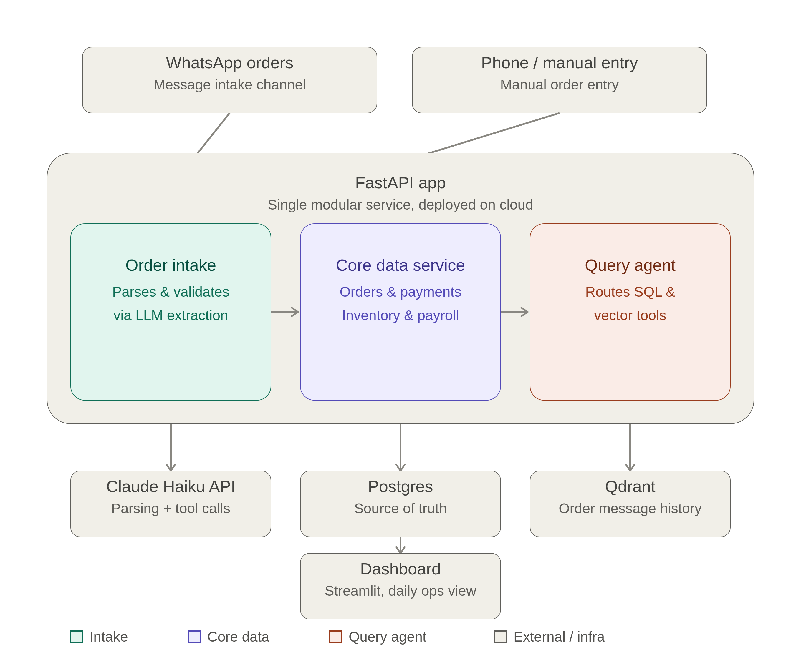
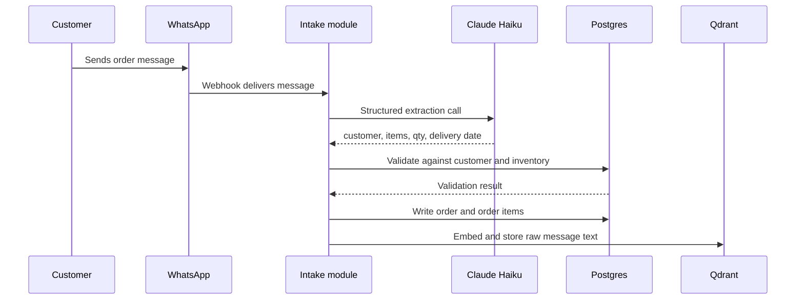
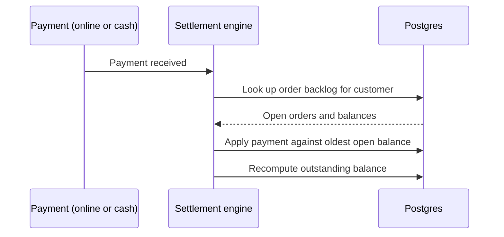

# Ganesh Sales: operations platform for a distribution business

A backend system I built for my family's edible oil distribution business. It replaces notebook and Tally tracking with a database, reads WhatsApp orders with an LLM, and lets the owner ask questions about the business in plain language.

## Why I built it

The business sells 300 to 400 tins of oil a day, 15 kg each, to 200 to 220 customers. It has 9 employees. Everything ran on WhatsApp messages, phone calls, a notebook and Tally.

- **Orders** came in as WhatsApp messages and were copied into a notebook by hand.
- **Payments** came in online and in cash, often as partial payments against older orders.
- **Reconciliation** at the end of the day took about an hour and still left balance gaps nobody could explain.

I wanted one place where orders, payments and stock are recorded once and the balances always add up.

## What it does

- **Order intake.** Reads confirmed WhatsApp order messages, extracts customer, items, quantity and delivery date, and checks them against the customer list and current stock.
- **Payment settlement.** Tracks partial and multi-invoice payments across online and cash, and works out what each customer still owes.
- **Daily closing.** Produces an end-of-day report so reconciliation is no longer manual.
- **Inventory.** Raises reorder alerts based on how fast orders are coming in and the day's market rate.
- **Payroll.** Tracks pay for the 9-person team.
- **Ask questions in plain language.** "What does this customer owe?" or "Which orders are still undelivered?" get answered from the real data.
- **Dashboard.** A Streamlit view of accounts, backlog, settlements, stock and daily closing.

## How it works

### 1. An order arrives

The LLM returns a fixed structure, not free text. Every extraction carries a confidence score. If the message is unclear (unknown customer, ambiguous item, unclear quantity), it goes to a review queue for a person instead of being guessed.

### 2. A payment arrives

Payments are stored separately from orders, so one payment can cover several orders and one order can be paid in parts. The outstanding balance is not stored. It is calculated from order totals minus payments each time, so it cannot drift out of sync. A payment that does not clearly match an order is flagged straight away instead of showing up as a gap at the end of the day.

### 3. Asking questions

One LLM has two tools:

- **A SQL tool** for exact answers: balances, delivery status, stock, backlog.
- **A vector search tool** over past WhatsApp messages, for fuzzy questions.

The model picks the tool and answers from what comes back. It does not make up numbers. The SQL tool is read-only and uses parameterized queries only.

## Tech stack

| Part | Technology |
|---|---|
| API and backend | Python, FastAPI |
| Database | PostgreSQL |
| Vector search | Qdrant |
| LLM | Claude Haiku (Anthropic API) |
| Dashboard | Streamlit |
| Messaging | WhatsApp Business API |

## Main design choices

- **One app, not microservices.** Intake, core data and the query agent are modules in a single FastAPI app. One deployment and one database connection means no network calls between them and no distributed transactions. That is enough for this size.
- **No queue.** Order volume is about 10 to 15 a day, so orders are processed directly when they arrive.
- **Review queue instead of guessing.** A wrong order costs real money, so uncertain extractions go to a person.
- **Balances calculated, not stored.** One less thing to keep in sync.
- **Market rate entered by hand.** It arrives as a text message with no API. A daily manual entry is simpler than a fragile message scraper for one number.

## Data

| Table | Holds |
|---|---|
| `customers` | Name and phone of each customer |
| `orders`, `order_items` | Each order and its line items |
| `payments` | Every payment, linked to an order |
| `inventory` | Stock level, reorder threshold, market rate |
| `employees`, `payroll_ledger` | Staff and what they are paid |

## What I would improve next

I have written up a stronger design for the next version. It focuses on making the system safer if something fails: saving every message before processing it, an append-only payment ledger, exact money types, tighter access controls, and monitoring that alerts when WhatsApp goes quiet. None of that is built yet.
